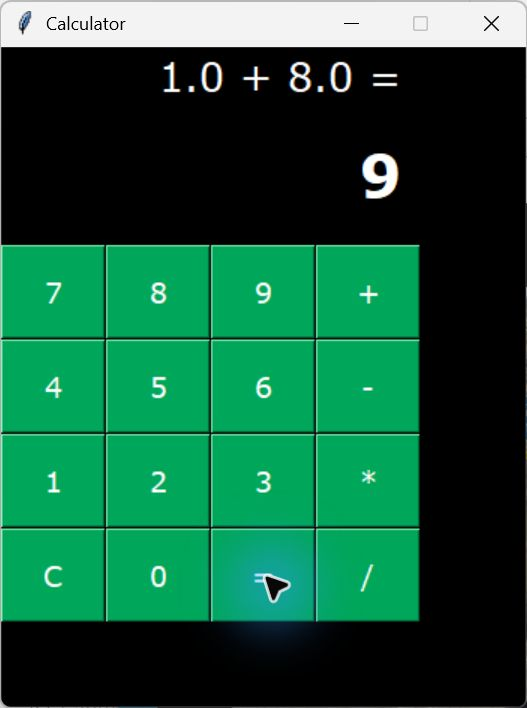
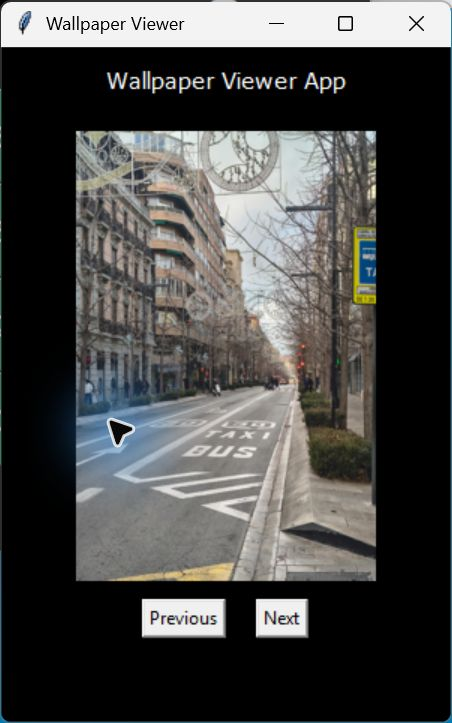
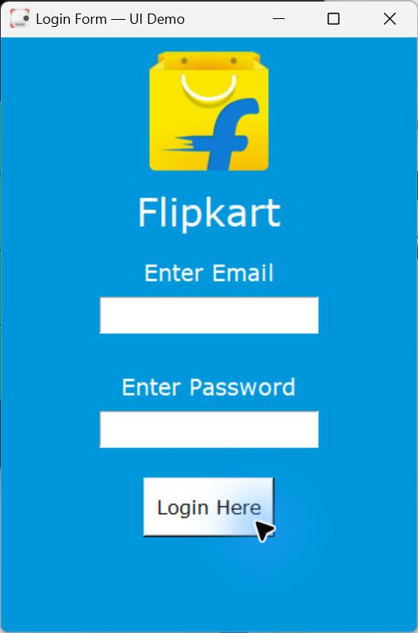
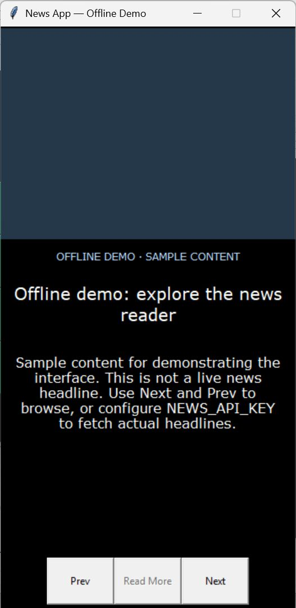

# Python GUI Projects

Four small desktop applications built with **Python and Tkinter**, exploring button callbacks, widget layouts, image handling, and API-backed content. These are learning projects that run locally, rather than hosted web apps.

## Applications

| App | What it does | Run from the repository root |
| --- | --- | --- |
| Calculator | Addition, subtraction, multiplication and division; operation history, clear, and input-error handling | `python Wallpapers/calculator.py` |
| Wallpaper Viewer | Browse the three bundled images with wrapping Previous/Next navigation | `python Wallpapers/wallpaper_viewer.py` |
| Login Form Demo | A styled email/password form with masked password entry and a local demo check | `python Wallpapers/tkinter_demo.py` |
| News Reader | Browse NewsAPI headlines, images and descriptions, and open an article in your default browser | `python Wallpapers/news_gui.py` |

## Screenshots

These are captures of the running desktop apps. The news screenshot uses explicitly labeled offline sample content, not live headlines.

| Calculator | Wallpaper Viewer |
| --- | --- |
|  |  |

| Login Form Demo | News Reader — Offline Demo |
| --- | --- |
|  |  |

## Setup

Use Python 3 with Tkinter available, and a graphical desktop session. The modified applications were syntax-checked with Python 3.14; dependencies are Pillow and requests.

```sh
git clone https://github.com/sania-commits/PYTHON_GUI_PROJECTS.git
cd PYTHON_GUI_PROJECTS
python -m venv .venv
```

Activate the environment on Windows PowerShell:

```powershell
.venv\Scripts\Activate.ps1
```

Or on macOS/Linux:

```sh
source .venv/bin/activate
```

Then install the dependencies:

```sh
python -m pip install -r requirements.txt
python -m tkinter
```

The last command should open a small Tkinter test window. If Tkinter is unavailable, install your operating system's Tk support or use a Python installation that includes it. Tkinter is not a pip dependency in this project.

Run any application using the commands in the table above. Image paths are resolved relative to the scripts, so you can launch from the repository root.

## News reader

The offline demo needs no API key or network connection:

```sh
python Wallpapers/news_gui.py --demo
```

For live US headlines, supply your own NewsAPI key in the environment. In PowerShell:

```powershell
$env:NEWS_API_KEY = "YOUR_NEWSAPI_KEY"
python Wallpapers/news_gui.py
```

Or on macOS/Linux:

```sh
export NEWS_API_KEY="YOUR_NEWSAPI_KEY"
python Wallpapers/news_gui.py
```

The reader handles missing keys, request failures, empty article lists, missing descriptions, and unavailable images. Image failures use a local plain-color placeholder. Live API behavior depends on your network and NewsAPI account access; it was not verified with a working key in this documentation pass. Requests currently run on the GUI thread, so fetching can briefly block the window.

An API key embedded in the previous code was removed from the current version. If that key is still active, revoke or rotate it in your NewsAPI account: deleting it from the latest file does not remove it from Git history.

## Login demo

Use `demo@example.com` and `demo123` for the local success message. These are public example values. The form does not authenticate real accounts, store credentials, or connect to Flipkart. The bundled brand image is used for a learning interface; no affiliation is claimed.

## Calculator behavior

Enter a number, select an operator, enter another number, and press `=`. `C` clears the display, history and pending operation. Division by zero or incomplete input displays `Error` instead of raising a callback exception. A digit starts fresh after an error. Fractional division results can be reused in the next operation; there is no decimal-entry button or full expression parser.

Run the callback regression tests without opening a GUI:

```sh
python -m unittest discover -s tests -v
```

## Repository layout

```text
Wallpapers/
  calculator.py
  wallpaper_viewer.py
  tkinter_demo.py
  news_gui.py
  wallpaper_viewer/       # bundled JPG images
  *.png, *.ico           # login-demo image assets
docs/screenshots/        # actual running-app captures
tests/test_calculator.py # callback and error-case checks
requirements.txt
```

## Maintenance and verification

The documentation pass fixed reversed wallpaper buttons, added deterministic image order and an empty-folder check, corrected calculator error handling, made login image paths portable, replaced personal login values with public demo values, and added news configuration and an offline preview. These maintenance changes and screenshots were prepared with agent assistance. Screenshot capture is evidence of the displayed UI, not a comprehensive certification of every application path.
